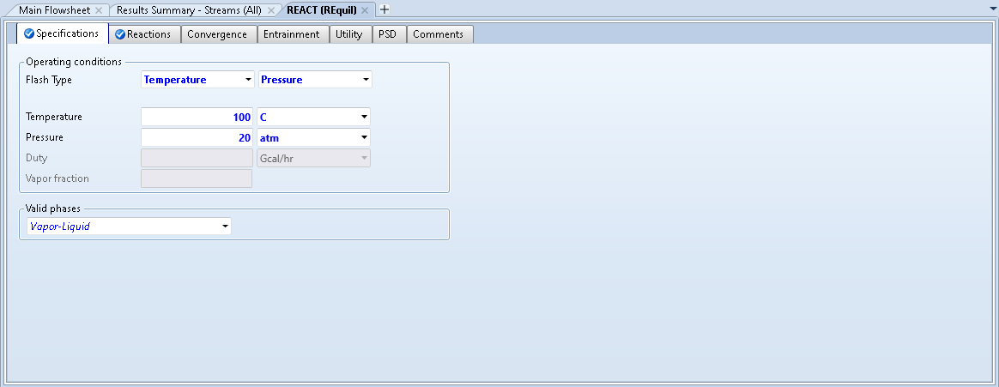
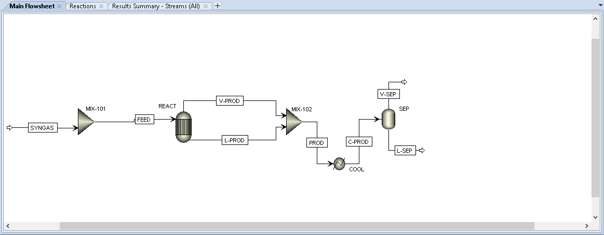
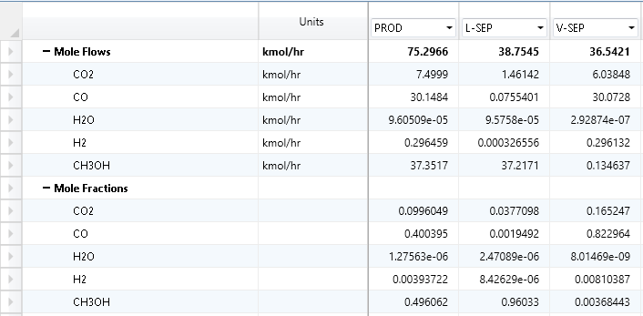
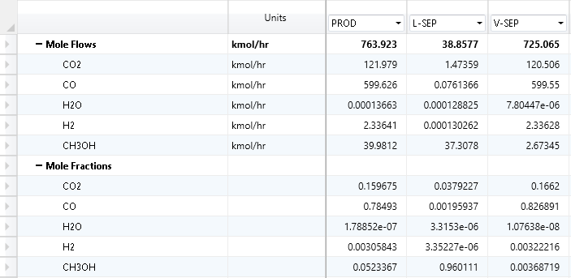
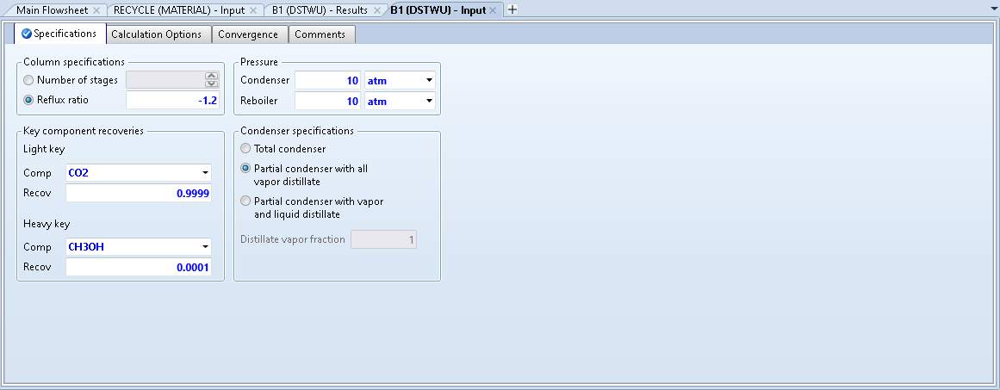
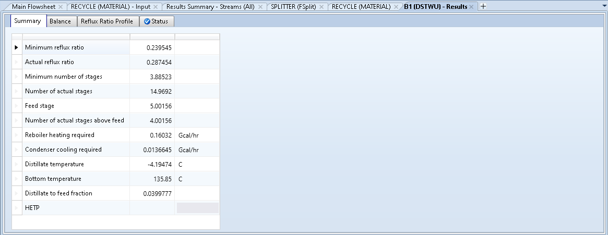
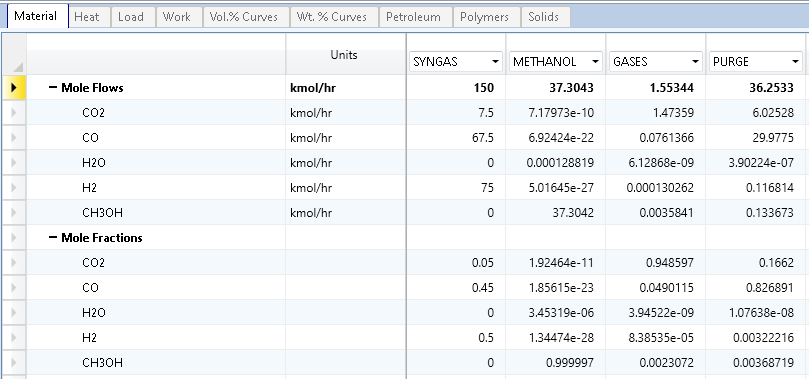

# Process Simulation of Methanol Production from Syngas

**Author** : [Rajdeep Dev](https://rajdeepdev10.github.io)  
**UBC ID** : 71666887

## Process Description

This project will focus on the production process of methanol from syngas. Syngas is a fuel mixture produced from natural gas that consists primarily of hydrogen and carbon monoxide, with small amount of methanol. On an industrial scale, methanol is predominantly produced from the reaction of hydrogen with carbon monoxide and carbon dioxide. The resulting gas mixture is then distilled to create pure methanol [[1]](/methanol-process-simulation/#references). This process is comprised of the following reactions is carried out at varying conditions [[2]](/methanol-process-simulation/#references): 

  CO + 2H2 → CH3OH (1)  
  CO2 + 3H2 → CO + H2O (2)  
  CO + H2O → CO2 + H2 (3)

Reaction 1 and 2 is carbon dioxide and carbon monoxide hydrogenation reaction to methanol. These reactions produce high amounts of crude methanol which is needed to purify by distillation. The operating condition is between 50-100 atm and 250 °C [[3]](/methanol-process-simulation/#references). Reaction 3 is known as “water-gas shift reaction” where carbon monoxide and steam are reacted using a catalyst to produce carbon dioxide and more hydrogen. The products from this reaction are recycled back to the hydrogenation reaction so it can work as reagents. Reaction 1 and 2 is endothermic reaction so low temperature and high pressure is favorable whereas water gas shift reaction is exothermic reaction. Catalysis will be ignored in this process simulation for each of the reactions. 

The simulation flowsheet begins with a stream carrying 150 kmol/h of syngas mixed with a recycle stream containing unreacted reactants. This mixture of reactants is sent to a REquil reactor (REACT) using the FEED stream. Since the reaction is operating at high temperature and pressure, reaction kinetics are much faster so a REquil reactor can be used to make a good model. The reactor operates at a temperature of 100 °C and 20 atm to produce methanol, with water as a side product. The vapor and liquid products from the reactor are mixed using MIX-102 and sent to the cooler (COOL) to cool the mixture to 10 °C. This condenses most of the methanol while most of the unreacted gases remain in vapor phase. A flash 2 block (SEP) simply separates the condensate from the vapor stream. The vapor stream from the flash block is recycled back to the reactor, after removing 0.05 mole fraction of the gas as purge using a splitter (SPLIT). The liquid stream from the flash block (L-SEP) contains 0.96 mole fraction of methanol and is sent to a Distillation column (COLUMN) where 37.3 kmol/h of 0.999997 mole fraction methanol is recovered as bottom product. The process yield of methanol calculated per mole syngas feed is 24.9%, which is realistic compared to typical industrial yield of 25% [[4]](/methanol-process-simulation/#references).  

## Process Flowsheet

 
*Figure 1: Aspen Plus Flowsheet for Methanol Production*

## Operating Conditions

### Feed Streams

| Stream name  | Component(s)| Composition/ Flowrates|P/T/vap. frac.           |
|:----------------------:|:-------------:|:-------------:|:-------------------:|
| SYNGAS      | Hydrogen | 0.5 mole fraction (of 150 kmol/h flowrate)  | 25 °C/1 atm                                |
| SYNGAS      | Carbon Monoxide      |  0.45 mole fraction (of 150 kmol/h flowrate)  | 25 °C/1 atm                                |
| SYNGAS | Carbon Dioxide     |   0.05 mole fraction (of 150 kmol/h flowrate)  | 25 °C/1 atm                                |

### Blocks

| Block name  | Specifications (P/T/vap. frac.)| Other notes |
|:----------------------:|:-------------:|:-------------:|
| MIX-101 (Mixer)       | Vapor-liquid  | - |                        
| REACT (REquil)       | 20 atm/100 C/Vapor-Liquid       |   See Screenshots below for further specification details  |                                
| MIX-102 (Mixer)  | Vapor-liquid       |    - |
| COOL (Heater)  | 10 C/Vapor-Liquid       |    - |
| SEP (Seperator)  | -       |    - |
| SPLIT (Splitter)  | Vapor-Liquid       |    See Screenshots below for further specification details  |
| COLUMN (RadFrac)  | 10 atm       |    See Screenshots below for further specification details  |

 
*Figure 2: REACT Specifications Window*

  

 
*Figure 3: REACT Reactions Window*

  

 
*Figure 4: SPLIT Specifications Window*

  

 
*Figure 5: COLUMN Configuration Window*

  

 
*Figure 6: COLUMN Streams Window*

## Analysis and Discussion

### Sensitivity Analysis of Reactor Condition

In this simulation, the amount of methanol produced from this process depends primarily on the conversion of carbon dioxide and carbon monoxide. It is important to perform a sensitivity analysis of this reaction to find the optimum conditions for the highest conversion of carbon dioxide and carbon monoxide. This reaction occurs at a high temperature and pressure, so a high amount of plant cost is used behind maintaining the operation conditions.   

A sensitivity analysis is initially performed at the constant temperature of 25 °C but varying pressure between 1-30 atm. Figure 7 shows a plot of methanol production flowrate at varying pressure. 

 
*Figure 7: Methanol Flowrate as a function of Reactor Pressure*
 
As seen in the figure, as the pressure of the reactor increase, methanol production will increase, but the methanol production remains constant after 20 atm so it is suitable reactor pressure to perform the methanol synthesis reaction. After performing sensitivity analysis on reactor pressure, a sensitivity analysis on temperature is performed as well. Figure 8 shows a plot of methanol flowrate as a function of reactor temperature. 

 
*Figure 8: Methanol Flowrate as a function of Reactor Temperature*

From the graph, we can conclude that with increase in temperature, the production of methanol with decrease. After 100 °C temperature, the decrease of methanol production is much steeper, so it will be desired to keep the reactor temperature operating at 100 °C. Higher temperatures would ideally increase the reaction rate, but it compromises with the reaction yield. Since rate is not investigated in this simulation, a lower temperature is selected compared to what is typically practiced in the industry.

### Recycle from Seperator

After performing sensitivity analysis, it is determined that the optimal operating conditions for maximum production of methanol is 100 °C and 20 atm which is close to industry standards. The next stage is separating methanol from the product stream, however adding a recycle stream from the product stream results in a higher conversion of syngas to methanol. Figure 9 below shows the process flow diagram without a recycle stream. 

 
*Figure 9: Process Flowsheet without a recycle stream*

From this flowsheet it is ideally desired to have maximum flowrate and mole fraction of methanol in the L-SEP stream, so that it can be recovered in the later step using a distillation column. Figure 10 shows the mole flow and mole fraction of the separator streams without any recycle stream in the flowsheet.  

 
*Figure 10: Stream Results without a recycle stream*

As seen in the figure, the vapor stream in the separator (V-SEP) contains a lot of unreacted syngas so it is desired to recycle this stream back to the reactor. Hence, a recycle stream is set up as shown in the [process flowsheet](/methanol-process-simulation/#process-flowsheet).  

The vapor stream from the separator is split into a recycle stream and a purge stream. The splitter has a split fraction 0.05 of the purge stream so that the recycle stream can converge and reach steady state. The default numerical methods in Aspen were selected for this recycle stream to converge. The calculations initially took 7 iterations to reach convergence of the stream. The initial results were then inserted as the initial guess of materials flow in the recycle stream. This recycle stream resulted in a molar flow of 37.31 kmol/h compared to 37.21 kmol/h of methanol without a recycle stream.  

 
*Figure 11: Stream Results with a recycle stream*

### Setting up a RadFrac Column

After condensating the methanol rich liquid stream from the flash drum, the final step of the methanol production process is to send the stream to a distillation column, to obtain a pure stream of methanol. Methanol produced from industrial process often typically have a purity of 99.9%. Before setting up a distillation column, we need few information about the column such as the number of stage, ideal feed stage, reflux ratio and distillate to feed ratio. These could be obtained by using a shortcut column (DSTWU) by specifying the light and heavy key recovery shown in Figure 12 below. This gives all the required information for setting up a distillation column. 

 
*Figure 12: DSTWU Column Specification*

  

 
*Figure 13: DSTWU Column Results*

The shortcut column is then replaced by distillation column (COLUMN) to recover pure methanol. This column has a reflux ratio of 0.287454 and distillate to feed ratio of 0.0399777. The number of stages is 15 and ideal feed stage is 5. 

In this methanol process simulation, 37.3 kmol/h of 0.999997 mol fraction methanol is recovered as bottom product from the distillation column from 150 kmol/h flow of syngas. Figure 14 shows a summary of molar flows and molar fractions of the streams entering and exiting the system boundary of this flowsheet.

 
*Figure 14: Molar flowrate and mole fractions of streams in the system boundary*

## References

[1] How Methanol is Made. Methanex Corporation. (n.d.). Methanex. https://www.methanex.com/about-methanol/how-methanol-made

[2] Wikipedia contributors. (2021, January 14). Methanol. Wikipedia. https://en.wikipedia.org/wiki/Methanol#From_synthesis_gas 

[3] Hydrogen Production: Natural Gas Reforming. (n.d.). Energy.Gov. https://www.energy.gov/eere/fuelcells/hydrogen-production-natural-gas-reforming#:%7E:text=In%20steam%2Dmethane%20reforming%2C%20methane,for%20the%20reaction%20to%20proceed. 

[4] Yang, L. (2016). Biogas and Syngas Upgrading. Advances in Bioenergy, Volume 1. Retrieved April 15, 2021, from https://doi.org/10.1016/bs.aibe.2016.09.003
